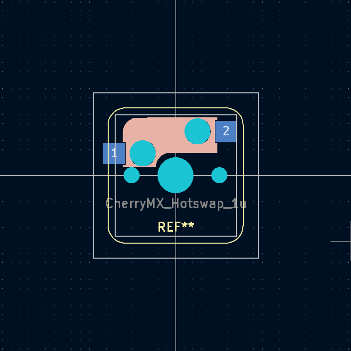
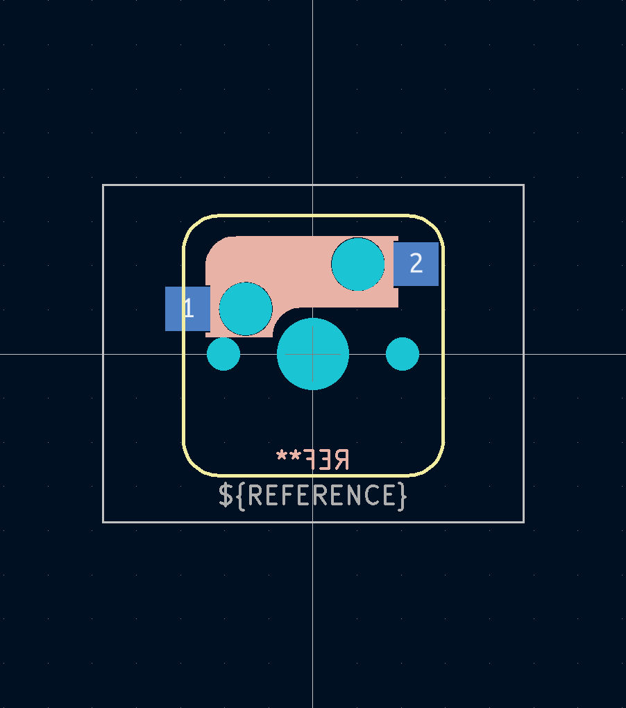
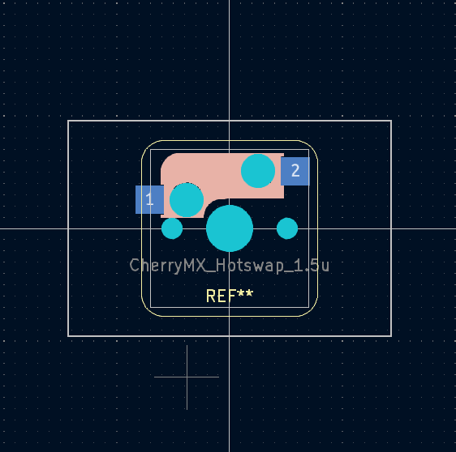
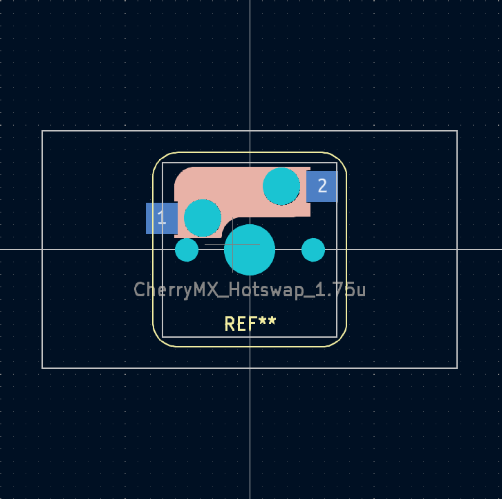
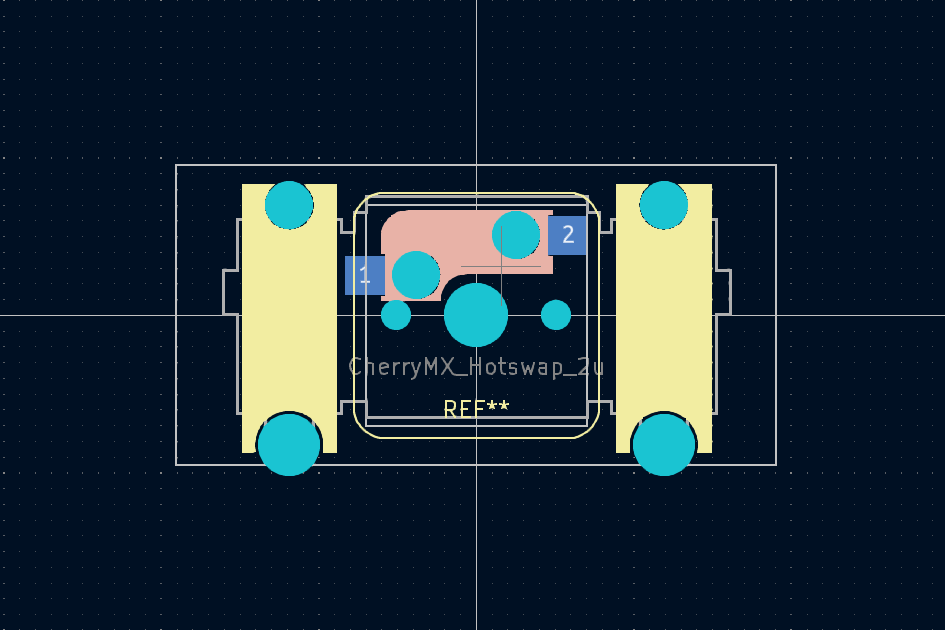
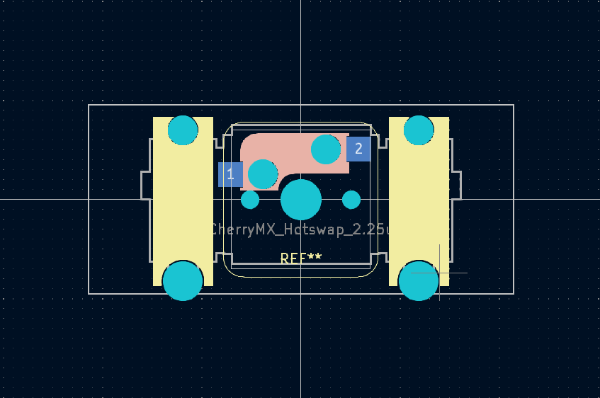
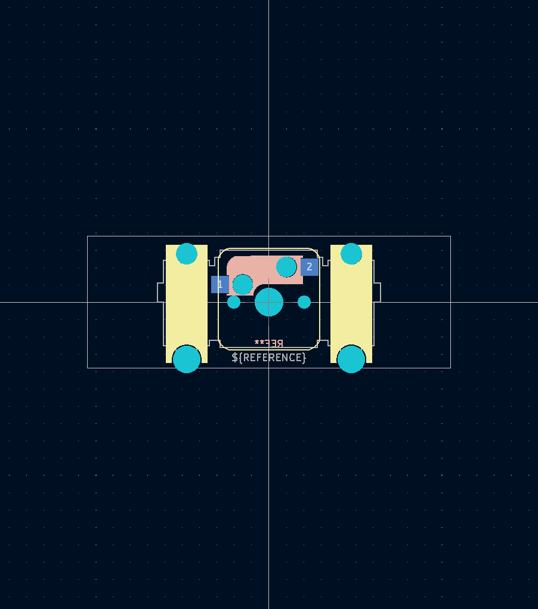
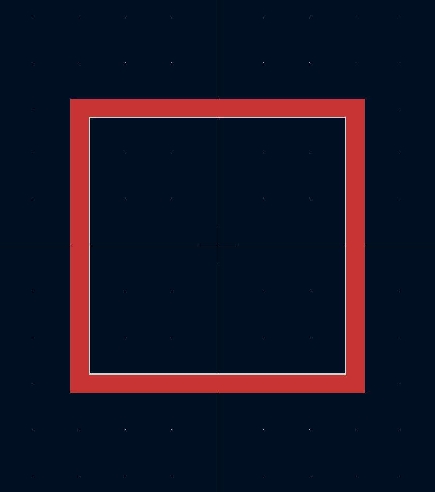
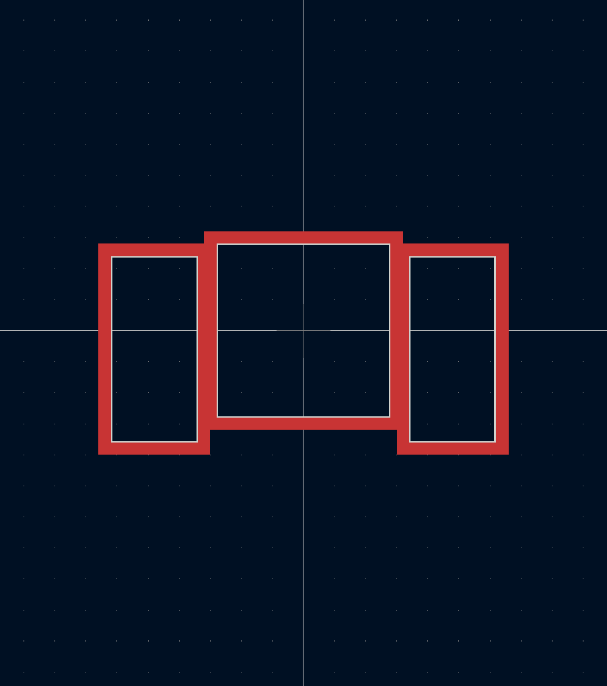
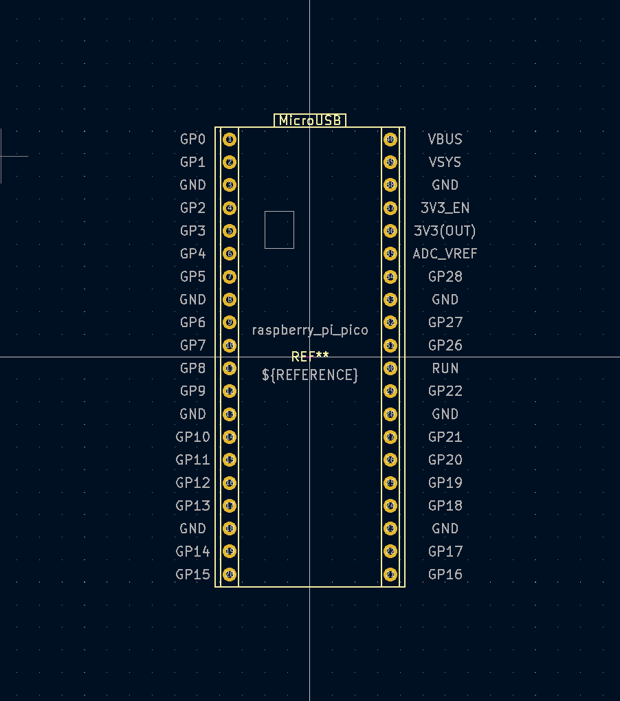

# kamo3_kicad_library

## footprint

| footprint | image |
| ----| ---- |
| SW_CherryMX_Hotswap_1.00u.kicad_mod |  |
| SW_CherryMX_Hotswap_1.25u.kicad_mod |  |
| SW_CherryMX_Hotswap_1.5u.kicad_mod |  |
| SW_CherryMX_Hotswap_1.75u.kicad_mod |  |
| SW_CherryMX_Hotswap_2.0u.kicad_mod |  |
| SW_CherryMX_Hotswap_2.25u.kicad_mod |  |
| SW_CherryMX_Hotswap_2.75u.kicad_mod |  |
| SW_CherryMX_Topplate_Hole.kicad_mod |  |
| SW_CherryMX_Topplate_Hole_With_Stabilizer.kicad_mod |  |
| raspberry_pi_pico.kicad_mod |  |