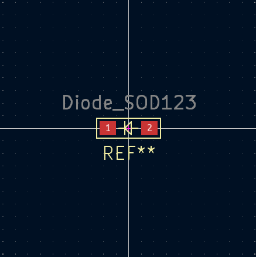
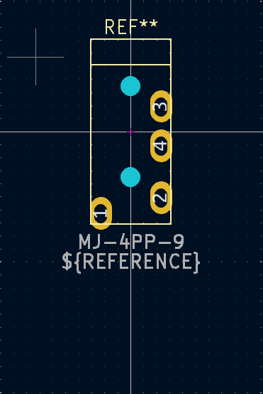
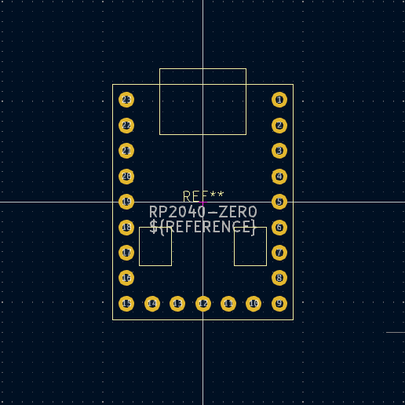
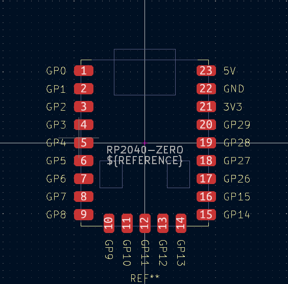
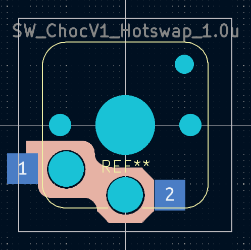
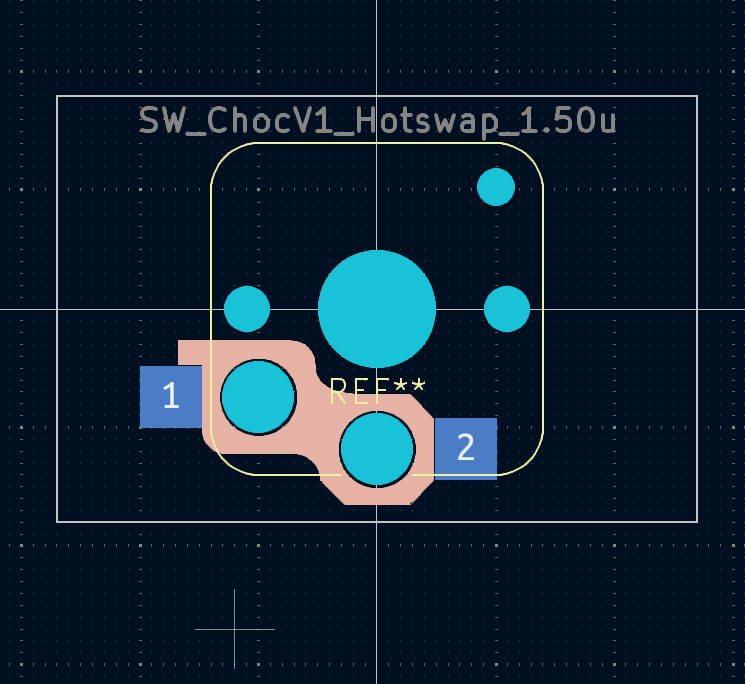
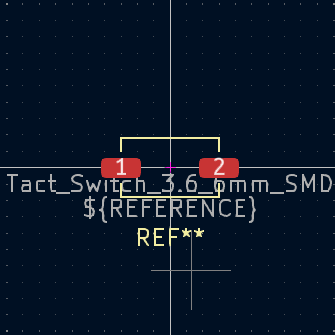
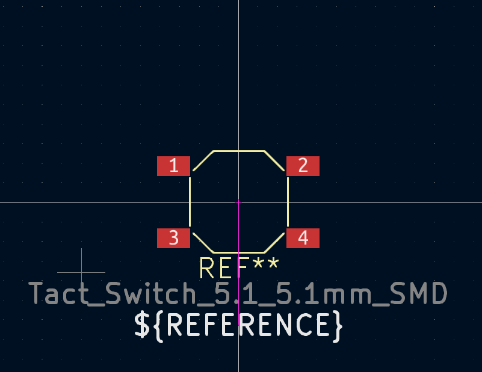
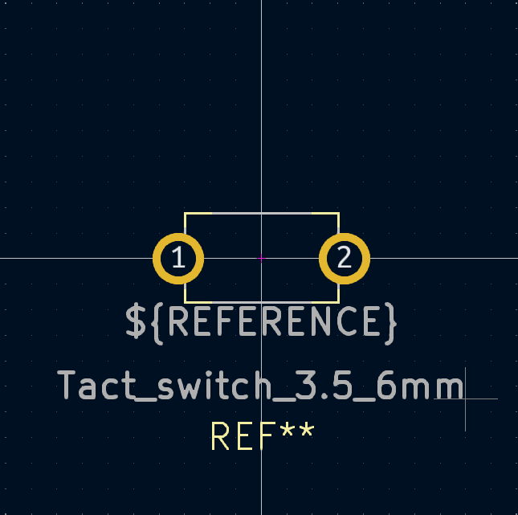

# kamo3_kicad_library

## footprint

| footprint | image |
| ----| ---- |
| Diode_SOD123.kicad_mod |  |
| logo.kicad_mod | |
| MJ-4PP-9.kicad_mod |  |
| RP2040-ZERO.kicad_mod |  |
| RP2040-ZERO_SMD.kicad_mod |  |
| SW_CherryMX_Hotswap_1.00u.kicad_mod |  |
| SW_CherryMX_Hotswap_1.25u.kicad_mod |  |
| SW_CherryMX_Hotswap_1.5u.kicad_mod |  |
| SW_CherryMX_Hotswap_1.75u.kicad_mod |  |
| SW_CherryMX_Hotswap_2.0u.kicad_mod |  |
| SW_CherryMX_Hotswap_2.25u.kicad_mod |  |
| SW_CherryMX_Hotswap_2.75u.kicad_mod |  |
| SW_CherryMX_Topplate_Hole.kicad_mod |  |
| SW_CherryMX_Topplate_Hole_With_Stabilizer.kicad_mod |  |
| SW_ChocV1_Hotswap_1.0u |  |
| SW_ChocV1_Hotswap_1.50u |  |
| raspberry_pi_pico.kicad_mod |  |
| Tact_switch_3.5_6mm.kicad_mod |  |
| Tact_Switch_3.6_6mm_SMD.kicad_mod |  |
| Tact_Switch_5.1_5.1mm_SMD.kicad_mod |  |

## symbol

| symbol |
| ---- |
| CR1220 |
| LED_6pin |
| RP2040-ZERO |
| Raspberry_Pi_Pico(without_debugPin) |
| SK6812MINI-E |
| SW_Push_4pin |
